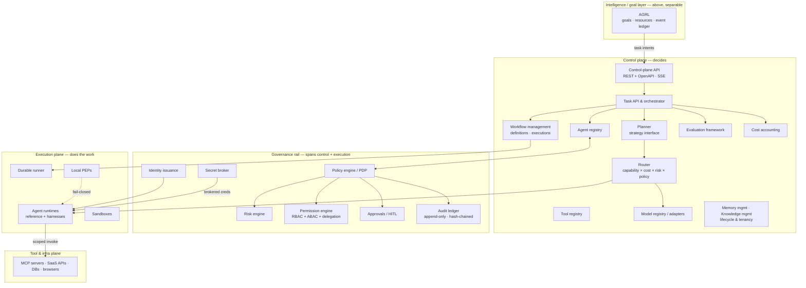
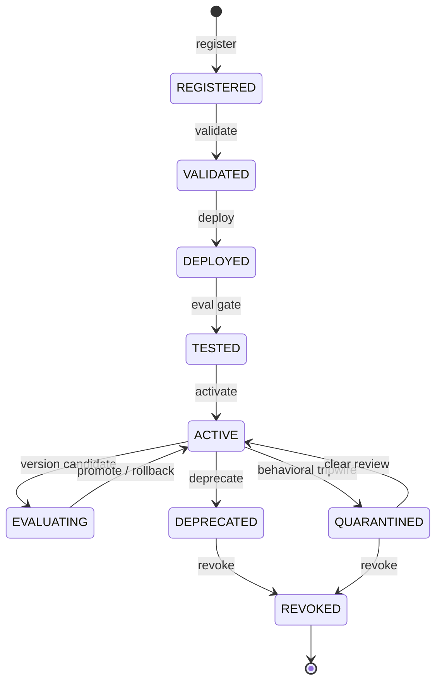
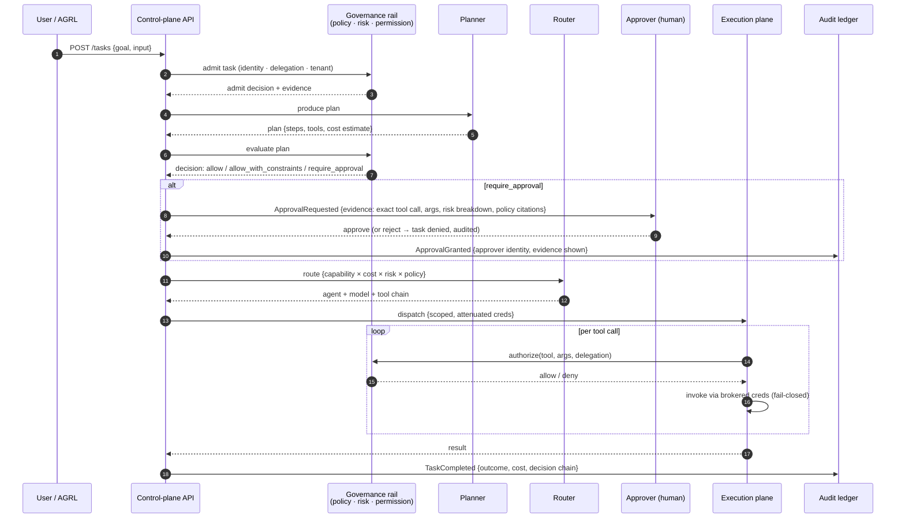
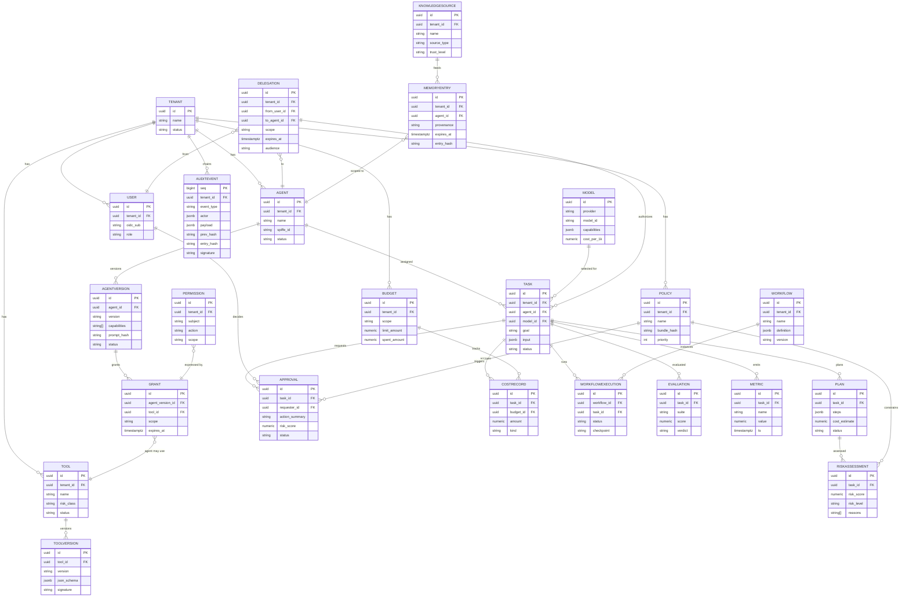

# Architecture

Companion to the research: `docs/research/architecture-analysis.md`,
`docs/research/kubernetes-comparison.md`,
`docs/research/technology-evaluation.md`. This document is the build's
normative reference; the research files are the evidence.

## 1. Purpose

The Agent Control Plane (ACP) is the governed, model- and tool-independent
management layer for fleets of autonomous AI agents. It separates
**decisions about agency** (who may act, with what authority, at what risk
and cost, under which policy, with what human oversight) from **execution
of agency** (the agent runtime, model calls, tool invocations).

The control plane owns contracts and coordination — registry, admission,
routing, policy, audit, lifecycle. It does not execute agent work.

## 2. Design principles

1. **Decisions about agency ≠ execution of agency.** Control plane decides;
   execution plane does. (Kubernetes principle: the API server doesn't run
   containers.)
2. **Fail closed everywhere.** Every failure defaults to deny/freeze/escalate;
   availability is recovered via redundancy and checkpoints, never by
   skipping authorization.
3. **The model is never the security boundary.** Properties must hold even
   if the model is fully compromised — enforced around it, not by it.
4. **Policy-before-execution.** Every consequential action passes an
   allow/deny/escalate check before executing. No advisory-only mode in
   production.
5. **Deny by default.** No explicit allow ⇒ deny. Platform guardrails
   override tenant policies on conflict.
6. **No ambient authority.** Agents hold zero standing credentials; all
   authority arrives per-action, just-in-time, scoped, and attenuated.
7. **Control traffic ≠ data traffic.** The control plane sees metadata and
   policy checkpoints, never bulk tool/model data.
8. **Declarative API, spec/status separation.** Standard verbs, watch
   semantics, explicit state machines — the Kubernetes API conventions
   that transfer.
9. **Build the differentiated layer; integrate the rest.** Registry +
   policy + router + controllers + audit are ours. Frameworks, MCP, Temporal,
   OPA, OTel, Vault, K8s are integrations behind interfaces.
10. **AGRL stays above and separable.** Goals/resource ledgers consume tasks
    from the Task API; the ACP never mutates goals.

## 3. Component architecture

### Modular monolith package map

`src/acp/` is organized into bounded packages; each maps to one or more
components above. Package boundaries are strict — a package may only use
another's public interface, so any package can later be extracted as a
service without rewrite.

| Package | Owns |
|---|---|
| `acp.registry` | agents, versions, tools, models, identity issuance records |
| `acp.tasks` | task API, task state machine, orchestrator |
| `acp.planner` | planner strategies (rule-based MVP; LLM later) |
| `acp.router` | agent+model+tool routing decisions |
| `acp.policy` | PDP interface, built-in MVP evaluator, OPA adapter |
| `acp.risk` | deterministic scorer, refinement hooks |
| `acp.approvals` | approval state machine, evidence payloads |
| `acp.workflows` | durable runner (MVP), `WorkflowBackend` interface |
| `acp.cost` | budgets, metering, alerts, kill switch |
| `acp.audit` | hash-chained append-only writer, verify |
| `acp.memory` / `acp.knowledge` | lifecycle management, retrieval interfaces |
| `acp.evaluation` | eval harnesses, version gates |
| `acp.identity` / `acp.secrets` | SPIFFE-shaped identity, secret broker interface |

## 4. Control plane

Single front door: REST API (`/api/v1`, OpenAPI 3.1) + SSE streams.
All state in Postgres (system of record). Admission chain on every task:
task admission → plan evaluation → risk scoring → policy decision →
approval gate → dispatch. Control traffic is low-volume, strongly
consistent, auditable.

The control plane is *off the hot path of execution* where possible — it
makes admission/routing decisions and observes via events; the execution
plane carries them out.

## 5. Execution plane

Agent runtimes (the agentic loop), the durable runner, workflow workers,
sandboxed code/browser execution, local PEP enforcement, execution
telemetry. Key invariant: the execution plane receives **scoped,
attenuated credentials** — never ambient authority — and policy
*enforcement* exists here (runtime interceptor, tool proxy) for
offline/edge agents and defense-in-depth. If the governance rail is
unreachable, the execution plane **denies high-risk actions by default**
and queues low-risk ones for re-adjudication.

## 6. Governance plane (rail spanning both)

The rail adjudicates once against full context in the control plane
(PDP: policy engine · risk engine · permission engine) and *realizes* the
decision across infrastructure with coordinated enforcement:
control-plane admission (before dispatch), runtime interceptor (before
tool call), tool proxy (before external call). Approvals/HITL, the audit
ledger, and identity/delegation all live here.

The rail exposes exactly one question to the rest of the system —
*"is this planned action permitted, and under what conditions?"* —
returning `allow` / `deny` / `require_approval` / `allow_with_constraints`.

## 7. Data plane (control vs data traffic rule)

- **Control-plane traffic:** registrations, task submissions, policy
  evaluations, approvals, status updates, audit writes. Low-volume,
  strongly consistent, auditable.
- **Data-plane traffic:** model tokens, tool payloads, file transfers.
  High-volume; flows runtime↔tool directly with the control plane seeing
  only **metadata + policy checkpoints**, never proxying bulk data.

Routing all tool traffic through the control plane is the fastest route to
a bottleneck and a single point of failure — the ACP routes, it does not
proxy (see §11).

## 8. Intelligence/goal layer (AGRL above, separable)

AGRL (Adaptive Goal & Resource Ledger) manages goals, resources, state
history, and the decision substrate. Boundary contract: AGRL emits **task
intents** (goal ref, constraints, budget caps) to the Task API. The ACP
never mutates goals, and the optimizer can never edit its own guardrails —
constraint flow is one-way (control policy → intelligence). Kept separable
so the control plane stays small and authoritative.

## 9. Security architecture

Zero-trust, agent-first: agents are a new principal class, not just
workloads. Four principal types (human/OIDC, agent instance/SPIFFE ID,
delegated authority/token-exchange, tool/brokered). Anti-confused-deputy
core:

1. No ambient authority.
2. Constrained delegation (subject, actor, scope, tenant, expiry, audience).
3. Credential brokering, not passing (HashiCorp Boundary + Vault pattern).
4. Dynamic short-lived secrets (5-minute leases where the runtime needs them).
5. Downward-only narrowing delegation; chains recorded in the ledger.

See `docs/security/threat-model.md` and `docs/research/security-analysis.md`.

## 10. Multi-tenancy

Hierarchy: Organization → **Tenant** (the security & billing boundary) →
{users, agents, tools, policies, knowledge, workflows, budgets, audit}.
Silo/pool/bridge per-layer (AWS SaaS Factory vocabulary): tenant IDs on
every row with Postgres RLS (or application-enforced `tenant_id`), per-tenant
policy bundles, per-tenant credential vaults, per-tenant cost budgets,
per-tenant audit hash chains, per-tenant vector/memory namespaces,
data-residency routing constraints in the router. Cross-tenant access is
architecturally impossible; any attempt is a critical security event.

## 11. Model abstraction

A `ModelProvider` adapter interface (capabilities, cost/latency metadata,
streaming) with OpenAI, Anthropic, Google, Bedrock, OpenRouter, Ollama
adapters. **Route, don't proxy**: the router selects on
capability×quality×latency×cost×risk×availability×policy; existing gateways
(OpenRouter-class, LiteLLM-class) are valid backends. Tenant model
allowlisting; output verification for high-stakes tasks.

## 12. Agent lifecycle

State machine (CREATE→REGISTER→VALIDATE→DEPLOY→TEST→ACTIVATE→MONITOR→
EVALUATE→VERSION→ROLLBACK→DEPRECATE→REVOKE) applies to agent versions.
Upgrading an agent's capabilities requires re-approval (no privilege creep).
Revocation propagates within seconds via lease expiry + event fan-out.

## 13. Failure handling (fail-closed table)

| Failure | Detection | Fail-closed behavior | Recovery |
|---|---|---|---|
| Governance rail unreachable | heartbeats | deny high-risk; queue low-risk for re-adjudication | freeze at checkpoints; resume on recovery |
| Approval timeout | watchdog | **deny** (never auto-approve) | re-issue or escalate |
| Budget exhaustion (100%) | real-time metering | **hard deny** | human re-authorization + raised envelope |
| Tool/API failure | errors, timeouts, health | mark degraded; circuit-break | retry w/ idempotency key → alternate tool |
| Runaway loop | iteration/time/token/spend caps | kill switch; freeze | human triage: resume tighter or abort |
| Prompt injection (confirmed) | detectors, canaries | revoke task authority; purge tainted context | re-issue with quarantine pattern |
| Compromised credentials | use anomaly, revocation events | immediate revocation | rotate; re-issue least-privilege |
| Memory poisoning | hash-chain failure, contradiction | quarantine affected memory | restore from signed snapshot |
| Model degradation | eval-score drop, timeouts | pause task; no tool calls on unverified output | retry w/ backoff → alternate approved model |
| Policy denial | decision = deny | block; agent re-plans within grants | request approval/elevation via proper channel |

## 14. Observability

OpenTelemetry from day one: traces, metrics, structured JSON logs. Every
trace carries decision provenance as span attributes —
`acp.task.id`, `acp.plan.id`, `acp.agent.selected`, `acp.model.selected`,
`acp.policy.decision`, `acp.policy.version`, `acp.risk.score`,
`acp.approval.id` — following OTel GenAI semantic conventions where
applicable. Prometheus/Grafana for metrics and dashboards; SSE streams for
live execution/approval feeds. Cost telemetry (tokens, tool calls) flows
through the same pipeline — this is how the "can't meter agents" gap
closes. Traces explain **decisions** (why this agent, which policy fired,
who approved), not just latency.

## 15. Scalability

- API tier stateless → horizontal scale; all state in Postgres/Redis.
- Redis Streams → NATS JetStream step-up path via `EventBus` interface.
- Read-heavy paths (registry lookups, policy evaluation) cached with
  short TTLs; revocation via event fan-out bounds staleness.
- Hardest constraint: runtime authorization latency on the tool-call hot
  path — policy decisions must be local/cached with async audit, or agents
  will route around the rail.
- Bulkheads between tenants; per-tenant quotas; rate limits; sandbox
  resource caps.

## 16. Disaster recovery

- Postgres: managed backups + point-in-time recovery; RPO/RTO defined per
  deployment tier.
- Audit ledger: append-only on WORM-capable storage; periodic chain-head
  anchoring to an external transparency log (V1) — protects against
  operator-side chain rewrite.
- Durable execution: checkpoints before every side-effecting step with the
  policy decision attached; recovery replays from the last verified
  checkpoint (idempotency keys make replay safe).
- Multi-region: control plane active-passive; execution plane can span
  regions with data-residency constraints enforced by the router.

## 17. Deployment models

Ship three artifacts from the start (53% of enterprises expect a hybrid
control plane — VentureBeat Q2 2026):

1. **Managed SaaS** — fastest land for mid-market/tech.
2. **Customer-VPC managed** — the FS sweet spot: vendor-operated control
   plane inside the customer's boundary (no agent metadata leaves).
3. **Air-gapped self-hosted** — table stakes for regulated banks, defense,
   sovereign deployments.

Local: `docker compose up`. Production: Kubernetes manifests + Helm (see
`infrastructure/kubernetes/`), Terraform scaffolding in V1. Cloud-neutral by
design — Postgres/Redis/K8s are everywhere; any cloud dependency in the
architecture would destroy the neutrality thesis.

### Governed task pipeline (sequence)

### ER diagram (MVP entities)

