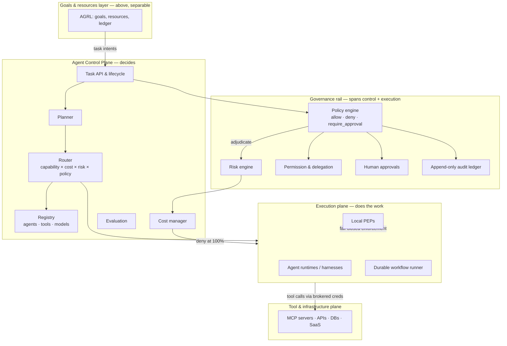
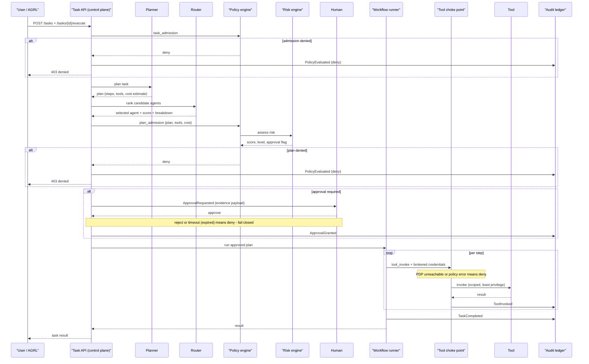
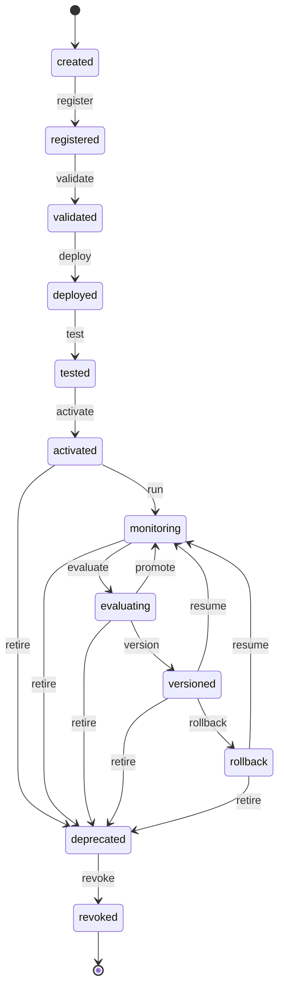
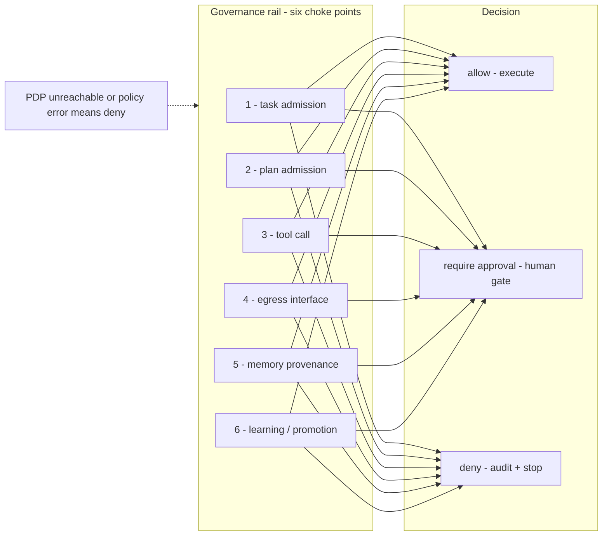
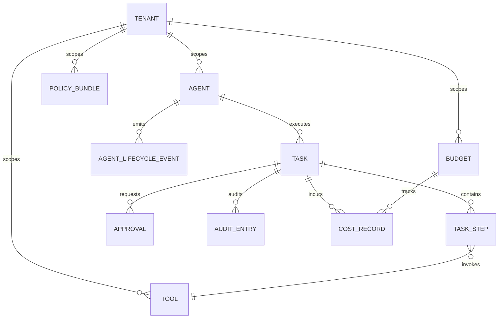
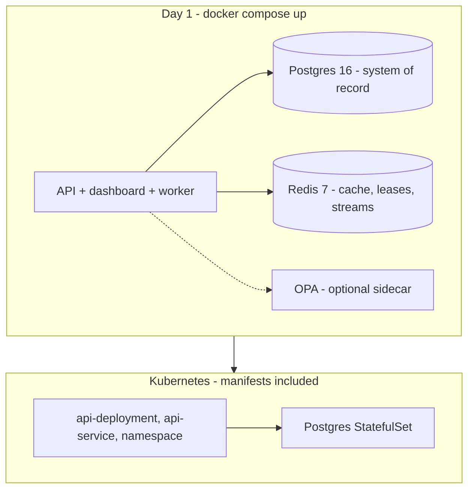

# Agent Control Plane

**The control plane for enterprise AI agents.**

An Agent Control Plane is the governed, model- and tool-independent management
layer that registers, authorizes, schedules, orchestrates, observes, evaluates,
and audits fleets of autonomous AI agents — separating *decisions about
agency* from *execution of agency itself*.

## What is this?

A modular-monolith service (Python) that answers, for every agent action:

**WHO / WHAT / WHEN / WHY / HOW / WITH WHICH MODEL / WITH WHICH TOOLS /
WITH WHICH PERMISSIONS / AT WHAT RISK / AT WHAT COST / UNDER WHICH POLICY /
WITH WHAT HUMAN OVERSIGHT** — and records the answers immutably after the fact.

Four pillars: **Register · Govern · Route · Operate.**

## Why does it exist?

Enterprises already run agents across 3–4 disconnected frameworks (average
3.1 per enterprise, VentureBeat Intelligence July 2026). Every harness
implements its own permissions, its own logging, its own budget guesses —
none offers fleet-wide, externally-enforced policy over a multi-vendor agent
estate. Only ~6% of enterprises would hand agent control to a
provider-managed service (VentureBeat Q2 2026); the top fears are vendor
lock-in (35%) and security/permissioning limits (37%). The category is real
but composite — IDC published a Feb 2026 Market Perspective on the
"Agentic AI Control Plane," and 51–53% of enterprises expect a hybrid control
plane by end of 2026.

**The problem:** proven use cases (service ops, fraud, logistics, IT ops) are
blocked at scale-up because no single layer governs *authority, risk, cost,
and evidence* across heterogeneous agent stacks.

## Who is it for?

- **Platform engineering** teams that own 2+ agent frameworks and need one
  registry, one policy layer, one audit trail.
- **CISOs / compliance** that need per-decision logging, human oversight,
  and tamper-evident audit chains (EU AI Act obligations map directly).
- **CIO/CTO** buyers who fear provider-resident control (lock-in, data
  residency) and want a cloud-neutral control layer.
- First vertical wedge: **financial services** (banks, insurers) — money-moving
  agents with regulatory pull — with IT operations as the in-vertical wedge
  and **logistics** as design-partner territory.



## Architecture

The layers above in motion — the full governed path from a task request
to an audited result. See [ARCHITECTURE.md](ARCHITECTURE.md) for the
normative reference.

### Governed task pipeline

`POST /tasks/{id}/execute` runs these stages. Every stage emits events
and audit entries; any denial stops the task immediately.



### Agent lifecycle

Exact transitions from `src/acp/state/__init__.py`:


Note: revoke is reachable from *every* state above.

### Governance rail choke points

Policy is evaluated *before* execution — never advisory-only in
production. The six choke points, matching `docs/api-reference.md` §5:



### Core data model

Entities from `src/acp/db/models.py` (relationships only — see
`models.py` for columns). Versions are columns on the agent/tool rows;
risk assessments live on the task; models are per-agent adapter configs.
Execution is modeled as tasks + steps (durable runner) — Temporal-backed
workflows arrive in Phase 3.



### Deployment topology

Day-one local dev is Docker Compose only — no cloud account required.
Kubernetes manifests ship in `infrastructure/kubernetes`; Helm, Terraform,
and NATS/Kafka are Phase 5. Cloud-neutral by design: no provider-managed
services required.



## Features

- **Agent & tool registry** — versioned agents with capabilities, verifiable
  identity; tool catalog with JSON schemas and risk classification.
- **Governed task pipeline** — admission → plan → risk → policy →
  (approval) → execute → audit, all fail-closed.
- **Policy engine** — `allow` / `deny` / `require_approval` /
  `allow_with_constraints`; platform guardrails > tenant policies > task
  constraints; deny-by-default. OPA/Rego PDP with a minimal built-in
  evaluator for local dev.
- **Risk engine** — deterministic factor scoring (destructive, financial,
  external side effect, irreversible) with model-based refinement hooks;
  ML can raise risk, never lower the deterministic floor.
- **Human approvals** — evidence-based approval payloads (exact tool call,
  args, risk breakdown, policy citations); approval timeout = deny;
  multi-person thresholds.
- **Cost management** — per-task/agent/tenant budgets; 50/80/95% alerts;
  hard deny at 100%.
- **Audit ledger** — hash-chained, Ed25519-signed, append-only; agents and
  tools have no write access.
- **Multi-tenancy** — tenant-scoped everything (registries, policies,
  budgets, audit chains); `X-Tenant-ID` scoping; Postgres RLS.
- **Model abstraction** — route, don't proxy: adapter interface across
  OpenAI, Anthropic, Google, Bedrock, OpenRouter, Ollama.
- **Observability** — OpenTelemetry traces/metrics/logs with decision
  provenance attributes; Prometheus/Grafana ready.

## Quick start

```bash
git clone https://github.com/ekuekpodar/agent-control-plane.git
cd agent-control-plane
cp .env.example .env   # placeholder values only — never real secrets
docker compose up -d
```

Then run the end-to-end demo:

```bash
make demo
```

Dashboard (read-only status): http://localhost:8000/dashboard

## End-to-end example (logistics)

See `examples/logistics-agent/` — a scripted demo driving only the REST
API:

1. Register `logistics-agent` (capabilities: `freight_quoting`,
   `carrier_booking`).
2. Register mock tools `carrier.quote` (risk: low) and `carrier.book`
   (risk: high) via a clearly labeled MOCK executor.
3. Create task: *"Find the best carrier for this shipment and book it if
   the total cost is under $2,500."*
4. `POST /tasks/{id}/execute` → planner proposes quote-then-book plan →
   policy engine flags `carrier.book` as high-risk → `require_approval`.
5. Task pauses at `awaiting_approval`; the demo prints the evidence
   (risk breakdown, policy citation), you approve → booking executes.
6. `GET /audit?task_id=` shows the full hash-chained decision evidence.
7. Variant: best quote $2,900 → exceeds the constraint → approval
   rejected → deny path demonstrated.

## API overview

Base URL: `/api/v1`. Auth: `Authorization: Bearer <API key>` +
`X-Tenant-ID: <tenant>`. Full contract in
[docs/api-reference.md](docs/api-reference.md).

| Endpoint | Purpose |
|---|---|
| `POST /api/v1/agents`, `GET /api/v1/agents` | Register / list agents |
| `POST /api/v1/tools`, `GET /api/v1/tools` | Register / list tools |
| `POST /api/v1/tasks` | Create task `{goal, input}` |
| `GET /api/v1/tasks/{id}` | Task status + detail |
| `POST /api/v1/tasks/{id}/execute` | Run the governed pipeline |
| `GET /api/v1/approvals?status=requested` | Pending approvals |
| `POST /api/v1/approvals/{id}/approve` · `…/reject` | Decide with evidence |
| `GET /api/v1/audit` | Query the audit ledger (`?task_id=`) |

## Security

Hard invariants, enforced everywhere:

- **Fail closed:** governance rail unreachable → deny high-risk; approval
  timeout = deny; budget exhaustion = deny.
- **Agents never inherit ambient user authority.** Effective authority =
  intersection of (user-delegable ∩ agent-granted ∩ task-scope ∩ policy).
- **Credential brokering:** the control plane injects short-lived, scoped
  credentials server-side at tool invocation. Secrets never enter agent
  context, traces, or memory.
- **The model is never the security boundary.** Every property holds even
  if the model is fully compromised.

Details: [SECURITY.md](SECURITY.md) · full threat model
[docs/security/threat-model.md](docs/security/threat-model.md) · research in
`docs/research/security-analysis.md`.

## Roadmap (summary)

- **Phase 2 — MVP (this repo):** registry, task pipeline, policy/risk,
  approvals, durable runner, audit, cost, multi-tenancy, dashboard.
- **Phase 3:** multi-agent orchestration, knowledge/RAG layer, evaluation
  engine, Temporal workflow backend.
- **Phase 4:** enterprise governance (OPA production PDP, delegation chains,
  per-tenant KMS, audit anchoring, air-gapped packaging).
- **Phase 5:** scale (Helm, Terraform, NATS, Qdrant, edge/offline PEPs).
- **Phase 6:** autonomous optimization under governance bounds.

Full plan: [ROADMAP.md](ROADMAP.md).

## Contributing

See [CONTRIBUTING.md](CONTRIBUTING.md). Discuss significant changes via an
issue or ADR (`docs/architecture/decisions.md`) first.

## License

Apache-2.0 (open core). See [LICENSE](LICENSE). Enterprise modules, if any,
ship separately under a commercial license (the Confluent split).
Avoids BSL — the HashiCorp/OpenTofu lesson: a restrictive core license
invites a fork precisely when the product matters.
